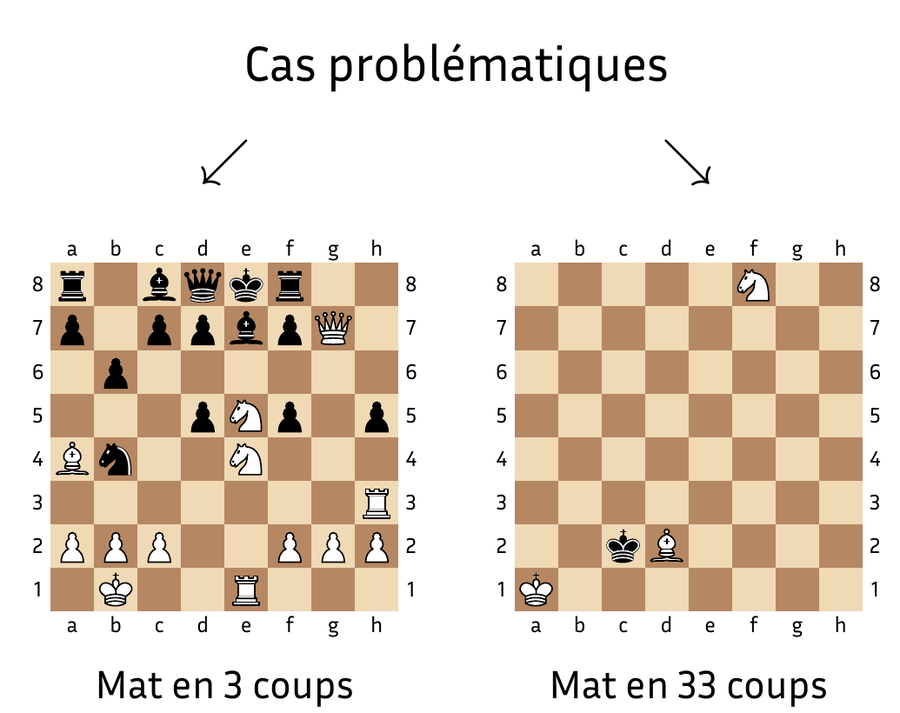

# Tables de finales d'échecs

Ce projet OCaml a été réalisé dans le cadre de mon TIPE sur la résolution algorithmique de problèmes de mat en N coups.

<p align="center">
  
</p>

*Le projet porte principalement sur le second cas: l'analyse rétrograde permet de pré-calculer des finales avec peu de pièces même à grande profondeur.*

Les positions sont représentées par des bitboards de 64 bits. Le programme génère les coups légaux puis construit des tables de finales par analyse rétrograde : il part des positions de mat et remonte les coups possibles jusqu'aux positions gagnantes. Les symétries de l'échiquier sont utilisées pour réduire la taille des tables.

Il s'agit du prototype utilisé pour le TIPE, pas d'un moteur d'échecs généraliste. Le travail porte principalement sur des finales comportant peu de pièces.

Le [support de présentation](docs/TIPE.pdf) détaille la démarche et les résultats obtenus.

## Compilation

```sh
opam install . --deps-only --with-test
opam exec -- dune build
opam exec -- dune test
```

L'exemple défini dans `bin/main.ml` génère une table Roi et Tour contre Roi, vérifie son intégrité, puis cherche une suite menant au mat :

```sh
opam exec -- dune exec chess_engine
```

La table est écrite dans `endgame.table`. La configuration et la profondeur de recherche peuvent être modifiées directement dans `bin/main.ml`.

## Organisation

- `lib/moves` : génération des coups et vérification de leur légalité
- `lib/endgame` : analyse rétrograde, sérialisation et lecture des tables
- `lib/utils` : bitboards, représentation du plateau et symétries
- `lib/solver` : première approche par recherche minimax
- `lib/graphics` : visualisation du contenu d'une table

## Licence

Ce projet est distribué sous la licence [GNU GPL v3](LICENSE).
